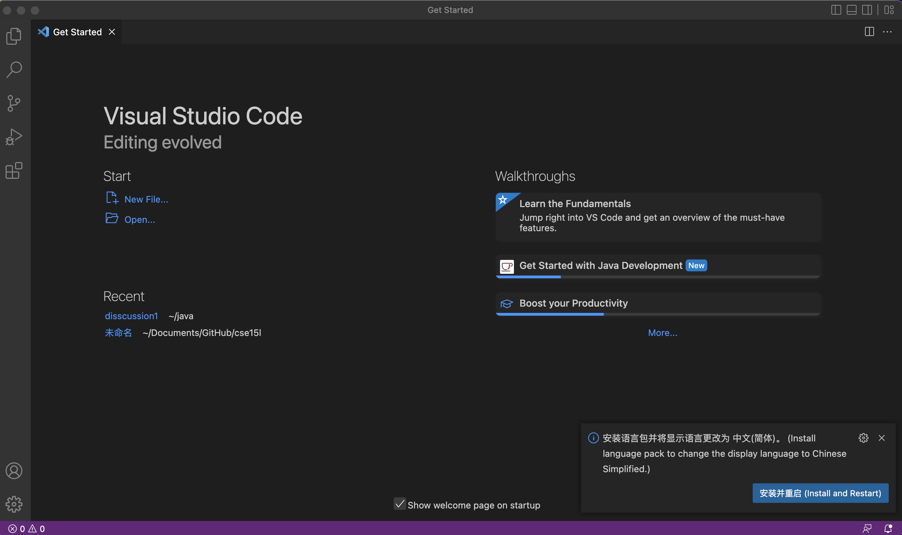
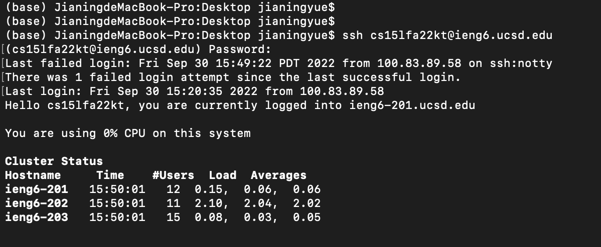
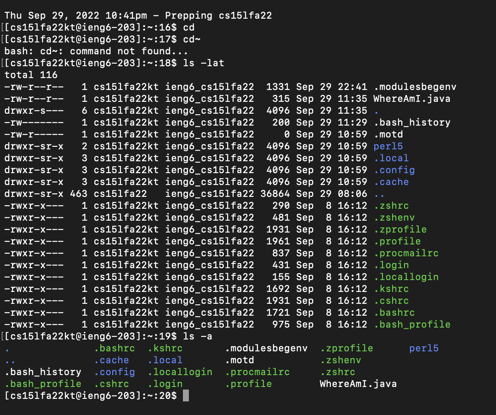
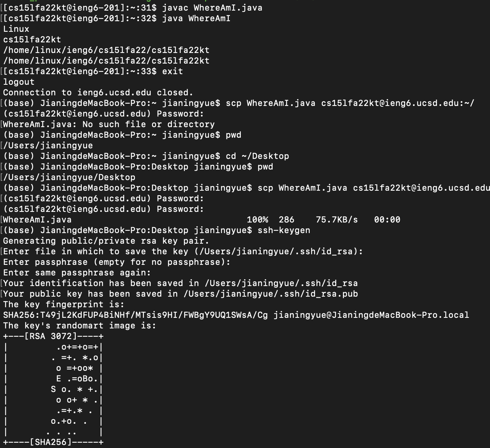
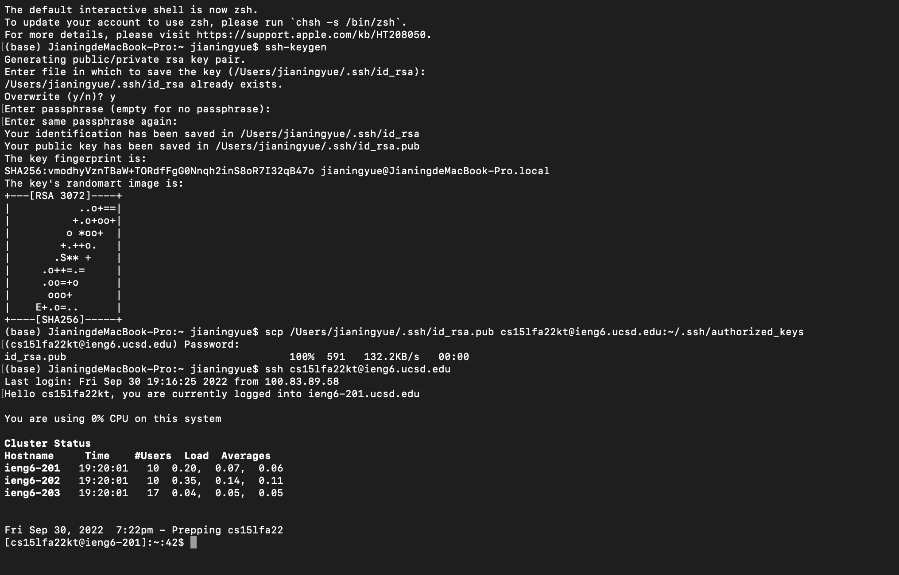
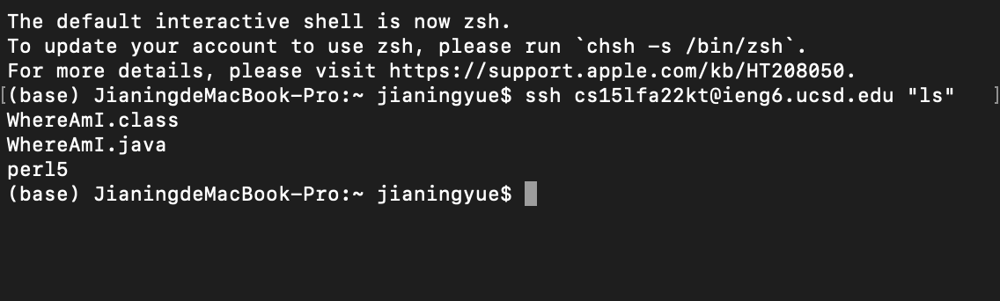
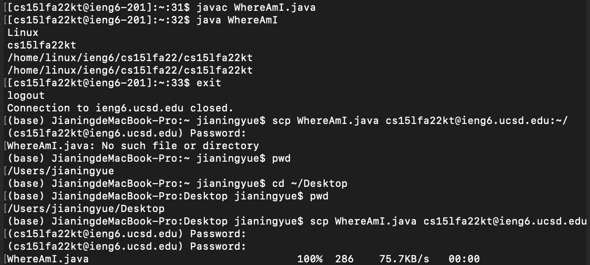

S1 is the page that VS code opened 
S2 is the screenshot after I use my username and password
S3 is the screenshot that i use two commands
in s7 i run the jave code and use scp command
s4 and s5 i tried two times, first time i faild but i got it in the second time
 s8 is the screenshot that use the hints